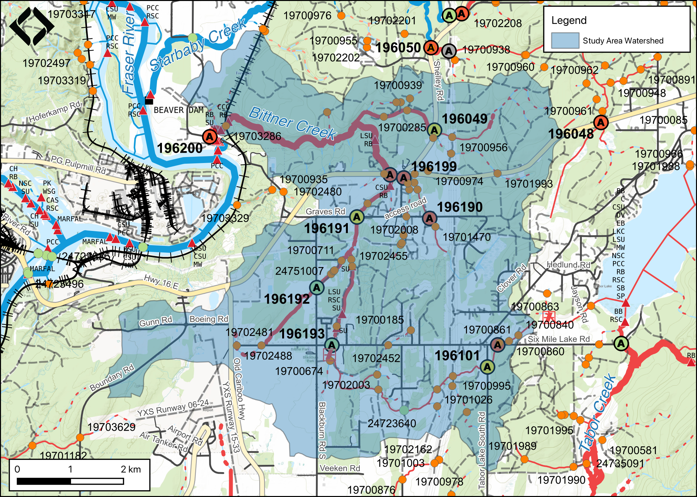
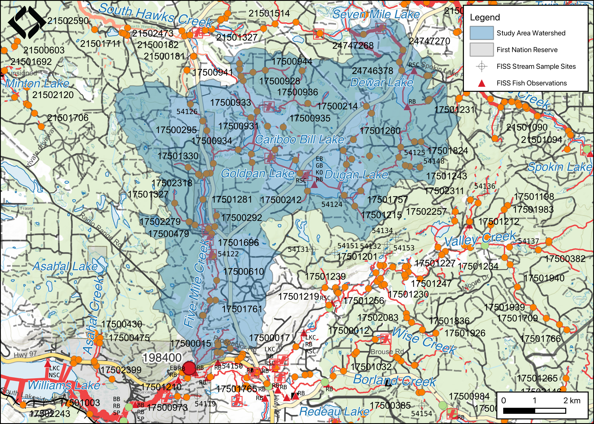

# Results and Discussion

A summary of monitoring site locations and metrics are presented in Tables \@ref(tab:tab-monitor-loc) and \@ref(tab:tab-monitor-sum).

```{r tab-monitor-loc}
mon_sum_raw <- readr::read_csv('data/form_monitoring.csv') %>% 
  select(pscis_crossing_id,
         stream_name,
         road_name,
         type = crossing_subtype,
         zone = utm_zone,
         easting,
         northing,
         diameter_or_span_m = diameter_or_span_meters,
         length_or_width_m = length_or_width_meters,
         dewatering:maintenance,
         recommendations) %>% 
  mutate(diameter_or_span_m = janitor::round_half_up(diameter_or_span_m, 1))
  # rename(site = pscis_crossing_id) 

mon_sum_raw %>% 
  select(
    pscis_crossing_id:length_or_width_m
  ) %>% 
  janitor::clean_names(case = "title") %>% 
  rename(
    `Diameter or Span (m)` = `Diameter or Span m`,
    `Length or Width (m)` = `Length or Width m`
  ) %>% 
  fpr::fpr_kable(caption_text = 'Summary of monitoring site locations and replacement structure specifications.',
                                       scroll = F)


```

<br>

```{r tab-monitor-sum, eval = T}

mon_metrics <- mon_sum_raw %>%
  
  mutate(pscis_crossing_id = as.character(pscis_crossing_id)) %>% 
  # mutate(across(everything(), as.character)) %>%
  select(
    stream_name,
    everything(),
    -zone:-length_or_width_m
  ) %>% 
  janitor::clean_names(case = "title") %>% 
  tibble::rownames_to_column() %>%
  pivot_longer(-rowname) %>% 
  pivot_wider(names_from=rowname, values_from=value) %>% 
  janitor::row_to_names(row_number = 1) %>% 
  janitor::clean_names(case = "title") 


mon_metrics %>% 
  fpr::fpr_kable(caption_text = 'Summary of monitoring metric results.',
                                       scroll = gitbook_on)
```


## Bittner Creek - 196200 

```{r  load-data-196200}
my_site <- 196200
```

PSCIS crossing 196200 on Bittner Creek is located on Foreman Road  within the municiple boundaries of the City of Prince George approximately `r round(fpr::fpr_my_bcfishpass(col_pull = downstream_route_measure)*0.001, 1)`km
upstream from the confluence with the Fraser River (Figures \@ref(fig:map-overview) - \@ref(fig:lidar-bittner)). In 2016, just downstream of the subject crossing, the banks of Bittner Creek were armoured to stabilize two areas of erosion [@dwbconsultingservicesltd_2019FishHabitat]. @dwbconsultingservicesltd_2019FishHabitat reported that to compensate for the net negative habitat balance of the project, the replacement of the culvert on Bittner Creek was included as a habitat enhancement in the habitat offsetting plan associated with permitting of the work. As part of that the offsetting design intended to maintain the plunge pool habitat that had been created downstream of the culvert by installing a rock weir on the upstream end of the pool.


<br>


At crossing `r as.character(my_site)`, Bittner Creek is a `r fpr::fpr_my_bcfishpass() %>% english::ordinal()` order stream with a watershed area upstream of the crossing of approximately `r fpr::fpr_my_wshd()`km^2^. The elevation of the watershed ranges from a maximum of `r fpr::fpr_my_wshd(col = 'elev_max')`m to `r fpr::fpr_my_wshd(col = 'elev_site')`m at the crossing (Table \@ref(tab:tab-wshd-196200)). 

<br>

The subject site is the first stream crossing structure upstream of the Fraser River with numerous modelled and previously assessed stream crossing structures upstream. Upstream of the site approximately 400m there is a crossing modelled (`modelled_crossing_id` 19703286) on the Canadian National railway line.  Although data related to the assessment of this crossing was not provided and has not been uploaded to the Provincial Stream Crossing Inventory Summary System (PSCIS), @dwbconsultingservicesltd_2019FishHabitat report that the "CN crossing is considered passable to fish". There are numerous other unassessed modelled crossings and previously assessed crossings on the stream with PSCIS crossing 196197 located approximately 5km upstream of the subject crossing on Highway 16.  Review of PSCIS database information indicates this crossing was dry at the time of assessment (August 9, 2014) and ranked as a barrier to upstream migration (unembedded, with slope of 2% and outlet drop of 40cm). Numerous wetland and lakes are mapped as upstream of the crossing covering a total area estimated at approximatley 40ha.

<br>

```{r map-bittner, fig.cap = 'Map of Bittner Creek watershed.',eval=T}

```

<br>

```{r lidar-bittner, fig.cap = 'Lidar generated digital elevation model of Bittner Creek at Foreman Road.',eval=T}
knitr::include_graphics("fig/lidar_bittner_fig.png")
```


<br>

```{r tab-wshd-196200, eval = T}
fpr::fpr_table_wshd_sum(site_id = my_site) %>% 
  fpr::fpr_kable(caption_text = paste0('Summary of derived upstream watershed statistics for PSCIS crossing ', my_site, '.'),
           footnote_text = 'Elev P60 = Elevation at which 60% of the watershed area is above',
           scroll = F)

```


<br>

```{r tab-culvert-bcfp-196200, eval = F}
# A summary of habitat modelling outputs is presented in Table \@ref(tab:tab-culvert-bcfp-196200) and a
fpr::fpr_table_bcfp(scroll = gitbook_on) 
```

### Crossing Characteristics 

Before remediation, the Bittner Creek culvert at PSCIS crossing `r as.character(my_site)` was documented as a 1.9m wide round culvert of 20m in length, having an outlet drop of 0.7m and a culvert slope of 1% [@moe2023PSCISAssessments].  The crossing ranked as a barrier to upstream migration according to the provincial protocol [@moe2011Fieldassessment] .  Photos taken in 2014 - before the remediation was completed are included as Figure \@ref(fig:photo-bittner-cv). 

<br>


In 2022, the site was reassessed. As PSCIS crossing `r as.character(my_site)` was a bridge it ranked as passable to upstream fish passage according to the provincial protocol (Table \@ref(tab:tab-culvert-196200)). 

`r if(identical(gitbook_on, FALSE)){knitr::asis_output("\\pagebreak")}`

<br>

```{r photo-bittner-cv, fig.cap=my_caption1}
my_photo1 = fpr::fpr_photo_pull_by_str(site = '196200/before', str_to_pull = 'crossing')

my_caption1 = paste0('Photos of culverts on Cross Creek taken in August 2014 before remediation of site.')

grid::grid.raster(jpeg::readJPEG(my_photo1))
```

<br>

```{r tab-culvert-196200, eval = T}
fpr::fpr_table_cv_summary_memo(dat = pscis_reassessments)

```

`r if(identical(gitbook_on, FALSE)){knitr::asis_output("\\pagebreak")}`


### Stream Characteristics 

Habitat characteristics were gathered upstream and downstream of the Foreman Road bridge over Bittner Creek (Figure \@ref(fig:lidar-bittner) and Table \@ref(tab:tab-habitat-summary-196200). Flows at the time of the survey were low with near dewatering throughout sections of stream surveyed both upstream and downstream.  Water temperature was `r fpr::fpr_my_habitat_info(col_pull = 'temperature_c', loc = 'ds')`$^\circ$C, pH was `r fpr::fpr_my_habitat_info(col_pull = 'p_h', loc = 'ds')` and conductivity was `r fpr::fpr_my_habitat_info(col_pull = 'conductivity_m_s_cm', loc = 'ds')`uS/cm. The landowner adjacent to the bridge (north-east side) was consulted to let them know that surveyors would be within the stream channel adjacent to their property. They reported that the stream dewatered completely on an annual basis and that they were not aware of use of the stream by Fraser River salmon.

<br>

Downstream of the bridge, the stream was surveyed for `r fpr::fpr_my_priority_info(loc = 'ds', col_pull = 'length_surveyed')`m. `r `fpr_my_habitat_paragraph('ds')` The portion of creek immediately downstream of the bridge (20m) was lacking meaningful riparian vegetation due to a lack of shrub/tree installation into riprap areas during construction and the very wide channel width in this location.   (due to infilling of historic large outlet pool).


```{r tab-habitat-summary-196200, eval=T}
tab_hab_summary %>% 
  filter(Site %like% my_site) %>% 
  fpr::fpr_kable(caption_text = paste0('Summary of habitat details for sites adjacent to PSCIS crossing ', my_site, ' on Bittner Creek.'),
                 scroll = F) 

```

<br>

### Discussion 

Although @dwbconsultingservicesltd_2019FishHabitat noted that installation of a rock weir on the upstream end of the historic culvert outlet pool was planned to maintain this habitat feature, it is unclear if this occurred.  Regardless, sediments have infilled the historic outlet pool and this area does not likely provide high or even moderate value habitat. 

<br>

Flows in Bittner Creek were low at the time of assessment and the adjacent landowner reports seasonal dewatering of the stream.  Nevetheless, numerous parr were observed within isolated pools upstream of the newly installed bridge and residual pools within intermittent systems can provide valuable habitat for juvenile salmon encouraging high growth rates and subsequent increased rates of overwinter survival [@ebersole_etal2006JuvenileCoho; @wigingtonjr_etal2006Cohosalmon; @maslin_mckinnev1998IntermittentStreams]. We recommend fish sampling to determine use of Bittner Creek habitats by chinook salmon for both spawning and rearing. As the site is located within Prince George city boundaries, potential collaborations could include programs involving University of Northern BC and local First Nations to understand not only fish health and movement but also overall watershed health including flow patterns and water temperatures. To encourage year round flows, in collaboration with local landowners/stewardship groups/First Nations, wetland area in the agricultural area to the north of the bridge (connected to first upstream tributary) should be assessed to determine if water storage could be increased by actions such as promoting beaver activity and infilling of historic drainage stuctures. The rail crossing located on the CN line (19703286) approximately 400m upstream of Foreman Road should be assessed for fish passage with the data gathered loaded to the PSCIS database. At the same time this area could be scoped for evidence of channel constriction, beaver management activities and other railway/agricultural land practices that may be promoting flushing of water through the area, channel incision and lowering of the water table.


<br>

```{r photo-196200-01-prep}

my_photo1 = fpr::fpr_photo_pull_by_str(site = my_site, str_to_pull = '_d1_')

my_caption1 = paste0('Habitat downstream of PSCIS crossing ', my_site, ', on Bittner Creek.')
```

```{r photo-196200-01, fig.cap= my_caption1, out.width = photo_width, eval=gitbook_on}
grid::grid.raster(jpeg::readJPEG(my_photo1))
```

<br>

```{r photo-196200-02-prep}
my_photo2 = fpr::fpr_photo_pull_by_str(site = my_site, str_to_pull = '_d2_')

my_caption2 = paste0('Habitat downstrewam of PSCIS crossing ', my_site, ', on Bittner Creek')

```

```{r photo-196200-02, fig.cap= my_caption2, out.width = photo_width, eval=gitbook_on}
grid::grid.raster(jpeg::readJPEG(my_photo2))
```

```{r photo-196200-u02, fig.cap = my_caption, fig.show="hold", out.width= c("49.5%","1%","49.5%"), eval=identical(gitbook_on, FALSE)}

my_caption <- paste0('Left: ', my_caption1, ' Right: ', my_caption2)

knitr::include_graphics(my_photo1)
knitr::include_graphics("fig/pixel.png")
knitr::include_graphics(my_photo2)
```

<br>

```{r photo-196200-03-prep}
my_photo1 = fpr::fpr_photo_pull_by_str(site = my_site, str_to_pull = '_pool_')

my_caption1 = paste0('Downstream view of location of historic outlet pool on Bittner Creek below Foreman Road which has filled with gravels due to culvert removal.')
```

```{r photo-196200-03, fig.cap= my_caption1, out.width = photo_width, eval=gitbook_on}
grid::grid.raster(jpeg::readJPEG(my_photo1))
```

<br>

```{r photo-196200-04-prep}
my_photo2 = fpr::fpr_photo_pull_by_str(site = my_site, str_to_pull = '_fish1_')

my_caption2 = paste0('Salmonid parr observed upstream of bridge on Bittner Creek.')

```

```{r photo-196200-04, fig.cap= my_caption2, out.width = photo_width, eval=gitbook_on}
grid::grid.raster(jpeg::readJPEG(my_photo2))
```

```{r photo-196200-u04, fig.cap = my_caption, fig.show="hold", out.width= c("49.5%","1%","49.5%"), eval=identical(gitbook_on, FALSE)}

my_caption <- paste0('Left: ', my_caption1, ' Right: ', my_caption2)

knitr::include_graphics(my_photo1)
knitr::include_graphics("fig/pixel.png")
knitr::include_graphics(my_photo2)
```

<br>

```{r photo-196200-05-prep}
my_photo1 = fpr::fpr_photo_pull_by_str(site = my_site, str_to_pull = '_u1_')

my_caption1 = paste0('Typical habitat upstream of Foreman Road bridge on Bittner Creek.')
```

```{r photo-196200-05, fig.cap= my_caption1, out.width = photo_width, eval=gitbook_on}
grid::grid.raster(jpeg::readJPEG(my_photo1))
```

<br>

```{r photo-196200-06-prep}
my_photo2 = fpr::fpr_photo_pull_by_str(site = my_site, str_to_pull = '_u2_')

my_caption2 = paste0('Typical habitat upstream of Foreman Road bridge on Bittner Creek.')

```

```{r photo-196200-06, fig.cap= my_caption2, out.width = photo_width, eval=gitbook_on}
grid::grid.raster(jpeg::readJPEG(my_photo2))
```

```{r photo-196200-u05, fig.cap = my_caption, fig.show="hold", out.width= c("49.5%","1%","49.5%"), eval=identical(gitbook_on, FALSE)}

my_caption <- paste0('Left: ', my_caption1, ' Right: ', my_caption2)

knitr::include_graphics(my_photo1)
knitr::include_graphics("fig/pixel.png")
knitr::include_graphics(my_photo2)
```

## Cross Creek - 198283
```{r  load-data-198283}
my_site <- 198283
```


```{r map-cross, fig.cap = 'Map of Weigert Creek',eval=F}
knitr::include_graphics("fig/elk_weigert_2022b.png")

# **Habitat Model Parameters** 
# * Spawning max gradient: 5.0%# 
# * Spawning discharge min (mean annual, m^3^/s): 0.05# 
# * Spawning discharge max (mean annual, m^3^/s): 76.00# 
# * Rearing max gradient:                         7.0%# 
# * Rearing discharge min  (mean annual, m^3^/s): 0.02# 
# * Rearing discharge max  (mean annual, m^3^/s): 30.00
```


PSCIS crossing `r as.character(my_site)` on Cross Creek is located on Babine Lake Road, approximately 30km north-east (45 minute drive) of the town of Burns Lake (Figure \@ref(fig:map-overview)). A map of the watershed (see modelled crossing id 500059) is provided in map attachment [`r fpr::fpr_my_bcfishpass(col_pull = dbm_mof_50k_grid)`](`r fpr::fpr_my_mapsheet(wshd = "babl", archive_date = "2022-09-06")`). At the time of reporting, the mapping for the stream was slightly incorrect with the site located approximately 100m to the north of where shown in the BC freshwater atlas and within Babine Lake Marine Provincial Park - Pendleton Bay Site boundaries. The road is the responsibility of the Ministry of Transportation and Infrastructure.

<br>

PSCIS crossing `r as.character(my_site)` was identified by the Lake Babine Nation, Dustin Snyder (Spruce City Wildlife Association) as a barrier to fish passage blocking sockeye attempting to spawn annually and brought to the attention of the Ministry of Transportation and Infrastructure.  The Ministry of Transportation and Infrastructure worked together with Fisheries and Oceans Canada and Canadian Wildlife Federation to plan and implement replacement of the existing culverts with an open bottomed geotextile soil arched reinforced structure designed by Terratech Consulting Ltd in the summer of 2021.  A short video documents the story [here](https://www.youtube.com/watch?v=m--Q-WFt0As&list=PLY-KTbpNXtBFU0Sey9vLs8ljL83ZvyXSk&index=1).  

<br>

An impassible 9m falls is located on the mainstem of the stream approximately 1km upstream of Babine Lake Road [@finsconsultingltd_2000Reconnaissance20; @moe2023ProvincialObstacles].  There are no other stream crossings modelled between the road and the falls.  Upstream of the crossing `r fpr::fpr_my_fish_sp()` have been recorded [@moe2023KnownBC; @norris2023smnorrisbcfishobs].  

<br>


At crossing `r as.character(my_site)`, Cross Creek is a `r fpr::fpr_my_bcfishpass() %>% english::ordinal()` order stream with a watershed area upstream of the crossing of approximately `r fpr::fpr_my_wshd()`km^2^. The elevation of the watershed ranges from a maximum of `r fpr::fpr_my_wshd(col = 'elev_max')`m to `r fpr::fpr_my_wshd(col = 'elev_site')`m at the crossing (Table \@ref(tab:tab-wshd-198283)). 

<br>

```{r tab-wshd-198283, eval = T}
fpr::fpr_table_wshd_sum(site_id = my_site) %>% 
  fpr::fpr_kable(caption_text = paste0('Summary of derived upstream watershed statistics for PSCIS crossing ', my_site, '.'),
           footnote_text = 'Elev P60 = Elevation at which 60% of the watershed area is above',
           scroll = F)
```

<br>

### Crossing Characteristics  

Before remediation, the Cross Creek culverts at PSCIS crossing `r as.character(my_site)` were documented as 1.8m wide ovals culverts of 12.4m in length, having an outlet drop of 0.45m and a culvert slope of 2% [@moe2023PSCISAssessments].  The crossing ranked as a barrier to upstream migration according to the provincial protocol [@moe2011Fieldassessment].  Photos taken in 2017 - before the remediation was completed are included as Figure \@ref(fig:photo-cross-cv). In 2022, the site was reassessed. As PSCIS crossing `r as.character(my_site)` was a newly installed open bottomed structure it ranked as a `r fpr::fpr_my_pscis_info(dat = pscis_reassessments, col_pull = barrier_result) %>% stringr::str_to_lower()` to upstream fish passage according to the provincial protocol (Table \@ref(tab:tab-culvert-198283)). 


<br>

```{r photo-cross-cv, fig.cap=my_caption1}
my_photo1 = fpr::fpr_photo_pull_by_str(site = '198283/before', str_to_pull = 'crossing')

my_caption1 = paste0('Photos of culverts on Cross Creek taken in November 2017 before remediation of site.')

grid::grid.raster(jpeg::readJPEG(my_photo1))
```

<br>

```{r tab-culvert-198283, eval = T}
fpr::fpr_table_cv_summary_memo(dat = pscis_reassessments)

```


<br>


Surveys were conducted with a remotely piloted aircraft upstream of the crossing with resulting images stitched into an orthomosaic and 3-dimensional model `r if(gitbook_on){knitr::asis_output(" presented in Figures \\@ref(fig:ortho-caption-cross) - \\@ref(fig:model-caption-cross).")} else knitr::asis_output("presented [here](https://www.mapsmadeeasy.com/maps/public/bc05b8efed3f42f28fced92614b08edd) and [here](https://www.mapsmadeeasy.com/maps/public_3D/bc05b8efed3f42f28fced92614b08edd).")`


<br>

### Stream Characteristics {-}      
`r fpr_my_habitat_paragraph(loc = 'ds')` Water temperature was `r fpr::fpr_my_habitat_info(col_pull = 'temperature_c', loc = 'ds')`$^\circ$C, pH was `r fpr::fpr_my_habitat_info(col_pull = 'p_h', loc = 'ds')` and conductivity was `r fpr::fpr_my_habitat_info(col_pull = 'conductivity_m_s_cm', loc = 'ds')`uS/cm.  

<br>


```{r ortho-198283, eval = identical(gitbook_on, TRUE)}
model_url <- '<iframe src="https://www.mapsmadeeasy.com/maps/public/bc05b8efed3f42f28fced92614b08edd" scrolling="no" title="Maps Made Easy" width="100%" height="600" frameBorder ="0"></iframe>'

knitr::asis_output(model_url)
```

```{r ortho-caption-cross, fig.cap= my_caption, out.width = "0.01%", eval = identical(gitbook_on, TRUE)}
my_photo = 'fig/pixel.png'

my_caption = paste0('Orthomosaic of newly installed open bottomed structure on Cross Creek.')

knitr::include_graphics(my_photo, dpi = NA)

```

<br>

```{r model-198283, eval = identical(gitbook_on, TRUE)}
model_url <- '<iframe src="https://www.mapsmadeeasy.com/maps/public_3D/bc05b8efed3f42f28fced92614b08edd" scrolling="no" title="Maps Made Easy" width="100%" height="600" frameBorder ="0"></iframe>'

knitr::asis_output(model_url)
```

```{r model-caption-cross, fig.cap= my_caption, out.width = "0.01%", eval = identical(gitbook_on, TRUE)}
my_photo = 'fig/pixel.png'

my_caption = paste0('3D model of newly installed open bottomed structure on Cross Creek.')

knitr::include_graphics(my_photo, dpi = NA)

```


<br>

```{r tab-habitat-summary-198283, eval=T}
tab_hab_summary %>% 
  filter(Site == '198283_ds') %>%
  fpr::fpr_kable(caption_text = paste0('Summary of habitat details for area surveyed downstream of PSCIS crossing ', my_site, ' on Cross Creek as well as within the replacement open bottomed structure (198283_x).'),
                 scroll = F) 

```

<br>

### Discussion
Overall, the restoration of fish passage at Cross Creek appears to be successful demonstrating meaningful collaboration between numerous groups including Lake Babine Nation, Spruce City Wildlife Association, the Ministry of Transportation and Infrastructure, Fisheries and Oceans Canada and Canadian Wildlife Federation. The streambed appears to be filling in well following one year of flows since restoration and at the time of assessment in 2022, numerous sockeye and kokanee were observed spawning upstream of the crossing. Follow up is recommended in 2023 to determine success of naturally regenerating riparian cottonwood seedlings as well as cuttings planted within the soil arched structure.


<br>

```{r photo-198283-01-prep}

my_photo1 = fpr::fpr_photo_pull_by_str(site = my_site, str_to_pull = '_d2_')

my_caption1 = paste0('Typical habitat downstream of PSCIS crossing ', my_site, 'in Cross Creek showing high value spawning gravels.')
```

```{r photo-198283-01, fig.cap= my_caption1, out.width = photo_width, eval=gitbook_on}
grid::grid.raster(jpeg::readJPEG(my_photo1))
```

<br>

```{r photo-198283-02-prep}
my_photo2 = fpr::fpr_photo_pull_by_str(site = my_site, str_to_pull = '_d3_')

my_caption2 = paste0('Typical habitat downstream of PSCIS crossing ', my_site, ' in Cross Creek.')

```

```{r photo-198283-02, fig.cap= my_caption2, out.width = photo_width, eval=gitbook_on}
grid::grid.raster(jpeg::readJPEG(my_photo2))
```

```{r photo-198283-u02, fig.cap = my_caption, fig.show="hold", out.width= c("49.5%","1%","49.5%"), eval=identical(gitbook_on, FALSE)}

my_caption <- paste0('Left: ', my_caption1, ' Right: ', my_caption2)

knitr::include_graphics(my_photo1)
knitr::include_graphics("fig/pixel.png")
knitr::include_graphics(my_photo2)
```

<br>

```{r photo-198283-03-prep}
my_photo1 = fpr::fpr_photo_pull_by_str(site = my_site, str_to_pull = '_u1_')

my_caption1 = paste0('Habitat upstream of PSCIS crossing ', my_site, ' in Cross Creek.')
```

```{r photo-198283-03, fig.cap= my_caption1, out.width = photo_width, eval=gitbook_on}
grid::grid.raster(jpeg::readJPEG(my_photo1))
```

<br>

```{r photo-198283-04-prep}
my_photo2 = fpr::fpr_photo_pull_by_str(site = my_site, str_to_pull = 'embankment')

my_caption2 = paste0('Habitat immediately upstream of PSCIS crossing ', my_site, ' in Cross Creek.')

```

```{r photo-198283-04, fig.cap= my_caption2, out.width = photo_width, eval=gitbook_on}
grid::grid.raster(jpeg::readJPEG(my_photo2))
```

```{r photo-198283-u04, fig.cap = my_caption, fig.show="hold", out.width= c("49.5%","1%","49.5%"), eval=identical(gitbook_on, FALSE)}

my_caption <- paste0('Left: ', my_caption1, ' Right: ', my_caption2)

knitr::include_graphics(my_photo1)
knitr::include_graphics("fig/pixel.png")
knitr::include_graphics(my_photo2)
```


## Five Mile Creek - 198400

```{r  load-data-198400}
my_site <- 198400
```


PSCIS crossing 198400 is located on Five Mile Creek under Highway 97 approximately 11km east of Williams Lake within the San Jose River watershed group (Figures \@ref(fig:map-overview) - \@ref(fig:lidar-5mile).  The structure is located within the boundaries of the Williams Lake 1 First Nation Reservation. The area around Five Mile Creek is home to T’exelcemc people of the T'exelc First Nation. The T'exelc First Nation (also known as the Williams Lake Indian Band) is part of the larger Secwepemc (Shuswap) Nation with traditional territory covering a vast area of central British Columbia. Secwepemctsin is the language of the Secwepem. It contains the cultural, ecological, and historical knowledge connecting the land and the people [@texelcemc2023; @firstpeoplesculturalcouncil2023]. The Five Mile Creek watershed upstream of the Highway encompasses three other First Nations reserve areas including Five Mile 3, James Louis 3A and Carpenter Mountain 15. Replacement of the historic structure (900mm round culvert) in 2016 was necessary to four-laneing Highway 97.

<br>

```{r map-5mile, fig.cap = 'Map of Five Mile Creek watershed.',eval=T}

```


<br>

```{r lidar-5mile, fig.cap = 'Lidar generated digital elevation model of Five Mile Creek at Highway 97.',eval=T}
knitr::include_graphics("fig/lidar_5mile.png")
```


Five Mile Creek flows into Borland Creek approximately 800m downstream of the highway then into the San Jose River a further 2.1km downstream.  The San Jose River in turn empties into Williams Lake approximately 4.5km downstream of the highway.  Although apparently a rare occurrence, due to impacts to Williams Creek which drains Williams Lake, there are reports of sockeye salmon ascending from the Fraser River to Williams Lake and in theory spawning in the San Jose River.  It is thought that these fish are from the Quesnel stock [@williamslaketribune2022].  

<br>

On Five Mile Creek Between the highway and the San Jose River there are two previously unassessed crossings modelled as closed bottom structures. The first (`modelled_crossing_id` 17500597) is modelled as 300m downstream and the second (`modelled_crossing_id` 17500595) is modelled as located approximately 1km downstream. There are numerous unassessed modelled crossings upstream of the highway as well as four dams documented between approximately 4km and 10km upstream of the highway.  

<br>

At crossing `r as.character(my_site)`, Five Mile Creek is a `r fpr::fpr_my_bcfishpass(site = 17501664, col_filter = modelled_crossing_id) %>% english::ordinal()` order stream with a watershed area upstream of the crossing of approximately `r fpr::fpr_my_wshd(site = 999)`km^2^. The elevation of the watershed ranges from a maximum of `r fpr::fpr_my_wshd(col = 'elev_max', site = 999)`m to `r fpr::fpr_my_wshd(col = 'elev_site', site = 999)`m at the crossing (Table \@ref(tab:tab-wshd-198400)). Upstream of the crossing `r fpr::fpr_my_fish_sp(site = 17501664, col_filter = modelled_crossing_id, col_pull = observedspp_dnstr)` have been recorded [@moe2023KnownBC; @norris2023smnorrisbcfishobs]. Numerous lakes and wetlands are located in the Five Mile Creek watershed including Dugan Lake (96ha), Goldpan Lake (41ha) and Cariboo Bill Lake (30ha). 

<br>

On assignment from Ministry of Transportation and Infrastructure in 2010, @tritonenvironmentalconsultantsltd_2014Highway97 captured rainbow trout downstream of the culvert with minimal effort however no fish were captured upstream of the crossing with 108 seconds of electrofishing effort. @caribouenvirotechltd_2005LakeStream sampled Five Mile Creek and an unnamed lake (00089SAJR) located approximately 5km upstream of the highway to provide information related to planning for construction of a dam on the lake. They documented taht the portion of Five Mile Creek located immediately downstream of the unnamed lake was a man-made ditch divided into drainage channels for water dispersal downstream. The noted that water temperatures were likely to be very high in the summer months and ranked the habitat value as "very poor". 

<br>

```{r tab-wshd-198400, eval = T}
fpr::fpr_table_wshd_sum(site_id = 999) %>% 
  fpr::fpr_kable(caption_text = paste0('Summary of derived upstream watershed statistics for PSCIS crossing ', '198400 on Five Mile Creek.'),
           footnote_text = 'Elev P60 = Elevation at which 60% of the watershed area is above',
           scroll = F)
```

### Crossing Characteristics


Although not documented in the PSCIS database, before remediation, @tritonenvironmentalconsultantsltd_2014Highway97 reported that the Five Mile Creek culvert at PSCIS crossing `r as.character(my_site)` was a 1.0m diameter, 45m long, round, non-embedded culvert with a gradient of 3% and ranked as a barrier to upstream migration according to the provincial protocol [@moe2011Fieldassessment].  However, @tritonenvironmentalconsultantsltd_2014Highway97 also reported that the culvert was "likely passable to adult fish during most flow conditions with the exceptions of freshet or flood flow".

<br>

The highway crossing on Five Mile Creek was assessed on September 16, 2022. PSCIS crossing `r as.character(my_site)` was embedded 80cm at the outlet of the culvert with no embeddedness at the inlet.  Due to the length of the 2.25m diameter round pipe (55m), a lack of embeddedness and culvert slope (3%) the structure ranked as a barrier to upstream fish passage according to the provincial protocol (Table \@ref(tab:tab-culvert-198283)). 

<br>

```{r tab-culvert-198400, eval = T}
fpr::fpr_table_cv_summary_memo(dat = pscis_phase1, site = 17501664, col_filter = my_crossing_reference)

```


### Stream Characteristics

Upstream of the highway, the stream was surveyed for `r fpr::fpr_my_priority_info(loc = 'us', col_pull = 'length_surveyed')`m. `r fpr_my_habitat_paragraph(loc = 'us')`    Water temperature was `r fpr::fpr_my_habitat_info(col_pull = 'temperature_c', loc = 'us')`$^\circ$C, pH was `r fpr::fpr_my_habitat_info(col_pull = 'p_h', loc = 'us')` and conductivity was `r fpr::fpr_my_habitat_info(col_pull = 'conductivity_m_s_cm', loc = 'us')`uS/cm. `r fpr_my_habitat_paragraph()` (Table \@ref(tab:tab-habitat-summary-198400)). At the time of the survey flows were high (bankfull depth) due to recent rain events and the water was very turbid.  Habitat value was assessed as low due to poor water quality and the small size of the stream.

<br>

```{r tab-habitat-summary-198400, eval=T}
tab_hab_summary %>% 
  filter(Site %like% my_site) %>%
  fpr::fpr_kable(caption_text = paste0('Summary of habitat details for ara surveyed upstream of PSCIS crossing ', my_site, ' on Five Mile Creek.'),
                 scroll = F) 

```

<br>

### Discussion

Five Mile Creek is a small system utilized by rainbow trout near the highway.  High levels of turbidity noted during the site visit along with past reporting by @caribouenvirotechltd_2005LakeStream, @tritonenvironmentalconsultantsltd_2014Highway97 indicate that the area upstream of the crossing had been impacted by fire, cattle use of riparian areas and the installation of dams and associated water drainage structures.

<br>

Replacement of crossing structures for small streams on large highways can be extremely expensive, requiring significant resources and time to complete. Although not ideal for facilitating upstream fish migration, horizontal drilling of pipes (versus the installation of open bottom structures) can help reduce costs related to construction and proper embedding of these pipes with substrate similiar to that found in adjacent natural reaches can provide conditions suitable for upstream fish migration.  Although the highway crossing ranked as a barrier to upstream migration, embedding the pipe for its full length would result in a ranking of "potential" barrier and likely provide channel roughness conditions suitable for all life stages of rainbow trout to migrate upstream. For this reason we recommend the addition of large cobble and boulder substrate at the upstream end of the pipe.  We also recommend that silt fencing installed for erosion and sediment control during construction be removed at the same time.

<br>

```{r photo-198400-01-prep}

my_photo1 = fpr::fpr_photo_pull_by_str(site = my_site, str_to_pull = '_u1_')

my_caption1 ='Habitat within construction footprint upstream of PSCIS crossing 198400 in Five Mile Creek.'
```

```{r photo-198400-01, fig.cap= my_caption1, out.width = photo_width, eval=gitbook_on}
grid::grid.raster(jpeg::readJPEG(my_photo1))
```

<br>

```{r photo-198400-02-prep}
my_photo2 = fpr::fpr_photo_pull_by_str(site = my_site, str_to_pull = '_u2_')

my_caption2 = 'Habitat upstream of construction footprint adjacent to crossing 198400 in Five Mile Creek.'

```

```{r photo-198400-02, fig.cap= my_caption2, out.width = photo_width, eval=gitbook_on}
grid::grid.raster(jpeg::readJPEG(my_photo2))
```

```{r photo-198400-u02, fig.cap = my_caption, fig.show="hold", out.width= c("49.5%","1%","49.5%"), eval=identical(gitbook_on, FALSE)}

my_caption <- paste0('Left: ', my_caption1, ' Right: ', my_caption2)

knitr::include_graphics(my_photo1)
knitr::include_graphics("fig/pixel.png")
knitr::include_graphics(my_photo2)
```
